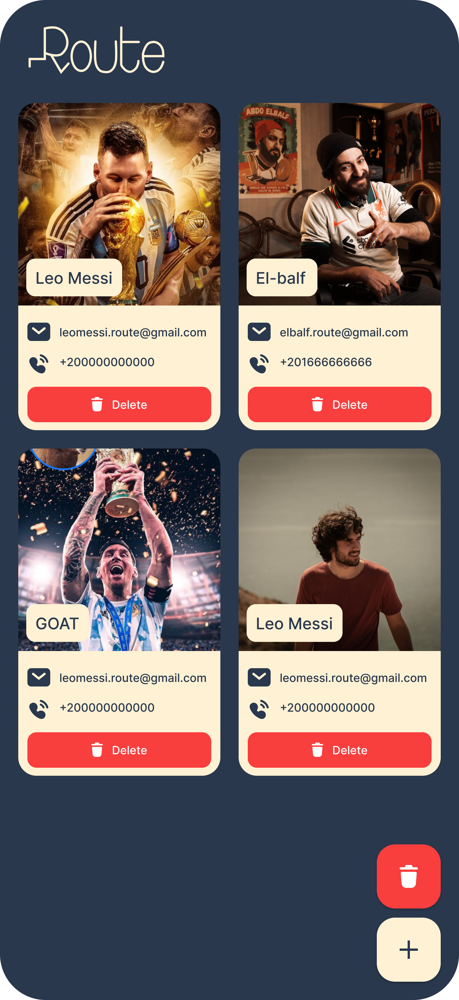

# 📇 Contact App

A simple and elegant Flutter mobile app to **manage your contacts** easily with a modern UI. This app allows users to **add**, **view**, **edit**, and **delete** contacts with an intuitive experience.

---

## 🚀 Goal

The Contact App aims to:
- 🧭 Provide a **user-friendly** interface for managing contacts.
- 🎨 Use a **clean and consistent design** with branding and typography.
- 👤 Offer a **personalized experience** by displaying user images, names, and info.
- ✅ Ensure a **smooth user flow** from splash to full contact list.

---

## 🖼️ UI Screens

  
  
  
    

## ✨ Features

- 🧾 Add new contacts with name, phone, and image.
- 🗂️ View all saved contacts in a scrollable list or grid.
- 🛠️ Edit existing contact details.
- ❌ Delete contacts with a simple button.
- 🎞️ Lottie animations for empty states.
- 🧭 Bottom Navigation for seamless navigation.
- 📱 Responsive and modern Flutter UI.

---

## 🧰 Tech Stack

- **Flutter** – Cross-platform mobile framework.
- **Dart** – Programming language.
- **Lottie** – For engaging animations.
- **Provider / setState**
- **SharedPreferences 

---

